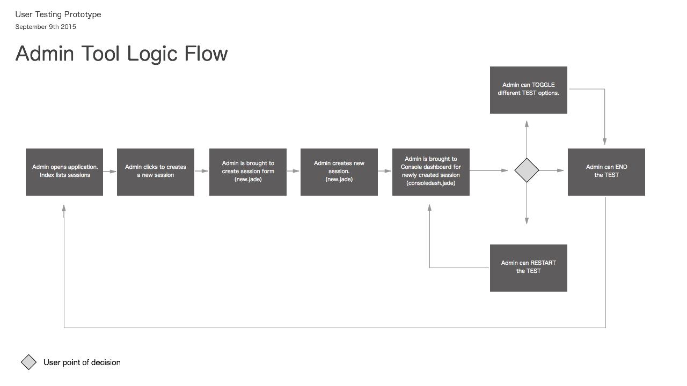

# Method UT Admin Tool

## Synopsis

TODO:

## Installation

Install MongoDB `brew install mongob`

Create MongoDB database `use databasename`

Install packages and start express.js server `npm install && npm start`

Head over to `http://localhost:3000/`

## User Flow

## Tasks

- [x] Architecture + Requirements
- [x] Create Express.js + Node.js Skeleton
- [x] Integrate MongoDB backend
- [x] FireBase Integration Begun
- [ ] Generate ID Codes that user will need to access test
- [ ] Clean up MongoDB session Schema
- [ ] Add Data object from Firebase to Mongo on change test state  
- [ ] Bootstrap + Styling
- [x] iFrame Integration
- [ ] QA

## Versions

TODO:

## Contributors

TODO:

## License

TODO:
